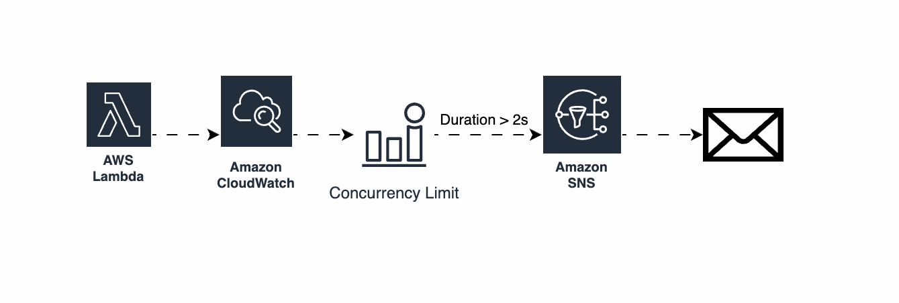

# AWS Lambda Duration Alarm Example

This repository provides an example of how to configure CloudWatch alarms to send email notifications when an AWS Lambda function exceeds a specified execution duration.

## Overview

The project uses AWS CDK (Cloud Development Kit) to create and deploy AWS resources, including Lambda functions and CloudWatch alarms. When any of the Lambda functions exceed the specified duration, an alarm is triggered and an email notification is sent via SNS (Simple Notification Service).

## Architecture


## Prerequisites

Before you begin, make sure you have the following:

- AWS CLI configured with appropriate credentials
- AWS CDK installed
- Node.js and npm installed

## Setup

1. **Clone the repository**

    ```sh
    git clone https://github.com/your-username/lambda-duration-alarm.git
    cd lambda-duration-alarm
    ```

2. **Install dependencies**

    ```sh
    npm install
    ```

3. **Configure your email for SNS notifications**

    Open `lib/lambda_alarms_stack.ts` and replace `your-email@example.com` with your email address to receive notifications.

    ```typescript
    const snsTopic = new sns.Topic(this, 'AlarmTopic');
    snsTopic.addSubscription(new subscriptions.EmailSubscription('your-email@example.com'));
    ```

4. **Deploy the stack**

    ```sh
    cdk deploy
    ```

## How It Works

- **Lambda Functions**: Three Lambda functions are created, each with a specified timeout and a delay to simulate long execution times.

- **CloudWatch Alarms**: A composite CloudWatch metric is created to monitor the execution duration of all Lambda functions. If any function exceeds the specified duration (n seconds), an alarm is triggered.

- **SNS Topic**: An SNS topic is configured to send email notifications when the alarm is triggered.

## Example

Here is an example of the alarm configuration:

```typescript
const compositeMetric = new cloudwatch.MathExpression({
  expression: "FIND_MAX([m1, m2, m3])",
  usingMetrics: metrics.reduce((acc, metric, index) => {
    acc[`m${index + 1}`] = metric;
    return acc;
  }, {} as { [key: string]: cloudwatch.IMetric }),
});

const alarm = new cloudwatch.Alarm(this, 'LambdaDurationAlarm', {
  metric: compositeMetric,
  threshold: 10000, // 10 seconds
  evaluationPeriods: 1,
  comparisonOperator: cloudwatch.ComparisonOperator.GREATER_THAN_THRESHOLD,
});

alarm.addAlarmAction(new actions.SnsAction(snsTopic));
```

## Cleanup

To remove all the resources created by this example, run:

```sh
cdk destroy
```

## Contributing

Feel free to submit issues and pull requests for improvements and new features.

## License

This project is licensed under the MIT License. See the [LICENSE](LICENSE) file for details.
